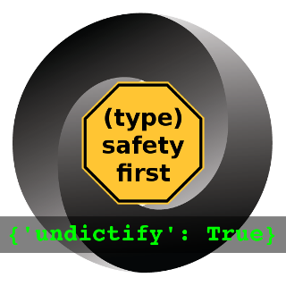

[][travis]
[][license]

[travis]: https://travis-ci.org/Dobiasd/undictify
[license]: LICENSE


undictify
=========
**Type-safe dictionary unpacking / JSON deserialization**


Table of contents
-----------------
  * [Motivation](#motivation)
  * [Details](#details)
  * [Requirements and Installation](#requirements-and-installation)


Motivation
----------

Imagine your application receives a JSON string representing an entity you need to handle:

```python
import json

tobi = json.loads('''
    {
        "id": 1,
        "name": "Tobias",
        "nick": "Tobi",
        "heart": {
            "weight_in_kg": 0.31,
            "pulse_at_rest": 52
        },
        "friends": [2, 3, 4, 5]
    }''')

katrin = json.loads('''
    {
        "id": 2,
        "name": "Katrin",
        "heart": {
            "weight_in_kg": 0.28,
            "pulse_at_rest": 57
        },
        "friends": [1, 3, 6, 7, 8]
    }''')
```

Now you start to work with it. Somewhere deep in your business logic you have:
```python
name_length = len(tobi['name'])
```
But that's only fine if the original JSON string was well-behaved.
If it had `"name": "Tobias",` in it, you would get:
```
    name_length = len(tobi['name'])
TypeError: tuple indices must be integers or slices, not str
```
which is not nice. So you start to manually do type checking:
```python
if isinstance(tobi['name'], str):
    name_length = len(tobi['name'])
else:
    # todo: handle the situation somehow
```

You quickly realize that you need to separate concerns better,
in that case business logic and input data validation.

So you start to do all checks directly after receiving the data:
```python
tobi = json.loads(...
if isinstance(tobi['name'], str):
    ...
if isinstance(tobi['age'], int):
    ...
if isinstance(... # *yawn*
```

and then transfer it into a type-safe class instance:
```python
class Heart(NamedTuple):
    weight_in_kg: float
    pulse_at_rest: int

class Human(NamedTuple):
    id: int
    name: str
    nick: Optional[str]
    heart: Heart
    friends: List[int]
```

Having the safety provided by the static type annotations (and probably checking your code with `mypy`) is a great thing for avoiding errors in the rest of your application and for helping your IDE to help you.
But all this boilerplate for validation code is cumbersome to write. 

So you decide to use a library that does JSON schema validation for you.
But now you have to manually adjust the schema every time your entity structure changes, which is not really DRY.

This is where undictify comes into play:
```python
from undictify import unpack_json
tobi: Human = unpack_json(Human, json.loads(...))
```

It uses the type information of your target class to safely unpack the dictionary into an object.
It throws exceptions with meaningful details in their associated values in case of an error like:
- missing a field
- a field having the wrong type

It also supports:
- optional values being omitted instead of being `None` explicitly
- skipping superfluous fields in the source dict, i.e., fields that are not present in the target


Details
-------

Undictify achieves the feat mentioned in the [motivation](#motivation) by `inspect`ing the types of the constructor parameters of the target class, instead of checking the actual members.

This allows classes to not only be plain data structures, but to do stuff with the valued given to them:
```python
class Person:
    def __init__(self, age: str) -> None:
        self.msg: str = f'Hi, I am {age} years old.'
    def say_something(self) -> None:
        print(self.msg)
        
somebody: Person = unpack_dict(Person, {'age': 28})
somebody.say_something()
```

Thus it is not limited to `class`es and `NamedTuple`s,
but it can do dictionary unpacking into arbitrary annotated functions.
So it resembles something like a type-safe version of `**kwargs`.

```python
def process(some_int: int, some_str: str) -> None:
    pass

result = undictify.unpack_json(process, '{"some_int": 42, "some_str": "foo"}')
```

It also supports valid type conversions, if you explicitly set its `convert_types` parameter to `True`.
This allows you to also use it for processing the arguments of an HTTP request you receive for example in a `get` handler of a `flask_restful.Resource` class:
```python
from undictify import unpack_dict

def target_function(some_int: int, some_str: str)

class WebController(Resource):
    def get(self) -> Any:
        result = unpack_dict(target_function, flask.request.args,
                             convert_types=True)
        # request.args is something like {"some_int": "4", "some_str": "hi"}
```

The values in the `MultiDict` `request.args` are all strings, but `unpack_dict` tries to convert them with `convert_types == True`.

This way the a request to `http://.../foo?some_int=4&some_str=hi` would be handled normally,
but `http://.../foo?some_int=four&some_str=hi` would raise an appropriate `TypeError`.


Requirements and Installation
-----------------------------


You need Python 3.6.5 or higher.

```bash
python3 -m pip install undictify
```

Or, if you like to use latest version from this repository:
```bash
git clone https://github.com/Dobiasd/undictify
cd undictify
python3 -m pip install .
```


License
-------
Distributed under the MIT License.
(See accompanying file [`LICENSE`](https://github.com/Dobiasd/undictify/blob/master/LICENSE) or at
[https://opensource.org/licenses/MIT](https://opensource.org/licenses/MIT))
